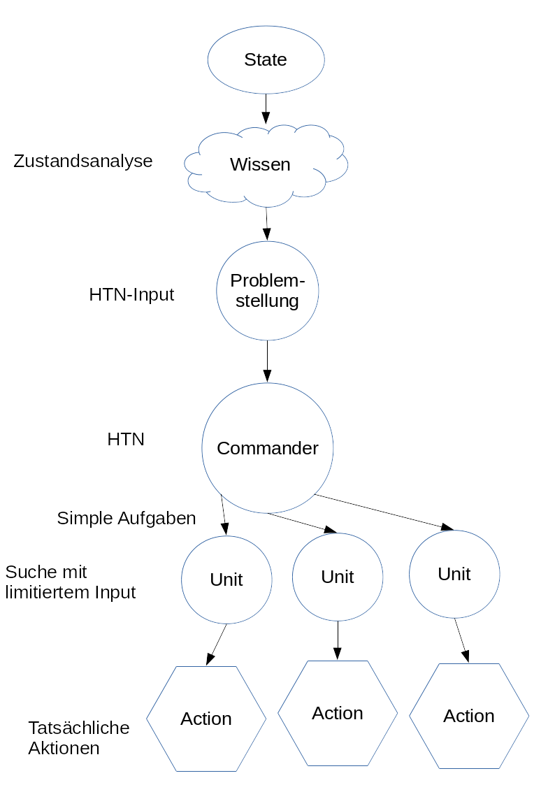

# Planung zu Lösung des MicroRTS Wettbewerbs

von Marcel Rothe, Florian Schoebel, Leonhard Tobisch

## Grundidee: Zerlegen des Problems in Teilaufgaben zur Minimierung des Baumes

Spielfigure erhalten eigene Intelligenz.  Ein Manager koordiniert die
Spielfiguren.  Ein gametree, welcher den gesamten Spielverlauf
abbildet lässt sich nicht so gut verkleinern wie gametrees für
einzelne Spieler. Wir erhoffen uns durch diese Aufteilung kleinere,
parallelisierbare gametrees und schnellere Entscheidungen.

Dieses Vorgehen ist an tatsächliche Kampfszenarien angelehnt, bei
denen Einheiten autonom unter Befehl einer höheren Instanz ein Ziel
erreichen.

## Logik für Manager

Der Manager wird mit einem HTN Ansatz verfolgt.  Die Spielfiguren
werden nicht sehr autonom sein. Der Grundgedanke ist, dass der
Manager die Aufgaben verteilt und die Spielfiguren sich mit der
Umsetzung beschäftigen.  Somit muss in dem HTN nicht mehr jede
einzelne Bewegung der Spieler berücksichtigt werden.  Es genügen
strategische Entscheidung (etwa: bewege Spieler 1 zu Pos(5,7), oder
baue Resourcen mit Spieler 2 ab).

## Logik für Spielfiguren

Für einzelne Spielfiguren kann der gametree drastisch verringert werden, denn:

- es genügt nur einen begrenzten Anteil des Spielfeldes im Umkreis des
  Spielers zu berücksichtigen (etwa 5x5 mit Spieler in der Mitte).
- einzelne Spieler haben sehr begrenzte Handlungsachsen (und die durch
  die derzeitige Aufgabenstellung des Spieler noch weiter verkleinert
  werden).

Die Entscheidungsfindung wird mit minimax umgesetzt.  Die
Evaluationsmethode hängt von der Aufgabe ab (welche der Manager
zuweist) und ist sehr aussagekräftig definierbar. Es ist leicht den
Erfolg von den speziellen Aufgaben des Spielers zu beschreiben (bei
Bewegung etwa Vergleich derzeitiger Position mit Zielposition). Dies
ist ein Vorteil gegenüber einem einzigen gametree für alle Spieler,
denn dann muss die Evaluationsmethode derart geringfügige Faktoren
auch berücksichtigen und erfordert mehr Rechenleistung.

# Fragen aus moodle

## Welche Algorithmik/Vorgehensweise soll angewendet werden?

Es werden HTN & minimax angewandt.  Für einen Manager wird HTN
genutzt. Er kontrolliert die Spielfiguren, indem er ihnen Aufgaben
zuweist.  minimax wird für die einzelnen Spielfiguren genutzt.

## Welche Literatur/Agenten erscheinen dazu relevant?
HTN & minimax sind relevant.

Beide werden jedoch in einem anderen Kontext genutzt:

- HTN für grobe Strategien und Navigieren der Einheiten
- minimax für einzelne Spielfiguren und nur sehr begrenzten Ausschnitt des Spieles

## Wo sehen Sie die Kernprobleme? Wie wollen Sie z.B. mit Evaluation von Zuständen umgehen? Wie wollen Sie die angehen?

### Intelligenz/Zustandsanalyse:

Um Entscheidungen treffen zu können muss der Manager den aktuellen Zustand einschätzen können. Diese muss auch recht schnell stattfinden, da erst nach dieser Phase tatsächlich gesucht werden kann. Die Entscheidung soll sich auf bereits gesehene Spiele stützen. Dies ist die größte Herausforderung und wird derzeit ans Ende angestellt. Um trotz fehlender Komponente entwickeln zu können wird dieser Teil in den frühen Phasen geskriptet.

### Problemset/Methodenset HTN
Es müssen die möglichen Zustandsbewertungen und Methodensets vorgegeben werden. Diese müssen unter Beobachtung möglicher Szenarien manuell herausgearbeitet werden. Hierbei kann man sich auf die bisherigen Ergebnisse stützen und diese weiter entwickeln.

## Was soll der Agent in 3 Wochen können? (WorkerRush 80% schlagen z.B.)

In der ersten Phase wird die Logik für einzelne Spielfiguren
umgesetzt. Der Manager kann im ersten Schritt fest geskriptet werden,
da auf einem einfachen Feld wenige Aufgaben verteilt werden müssen um
sich (zumindest gegen einen Random Gegner) zu beweisen.

In einem späteren Schritt wird der Manager mit AHTN modelliert.

Wir erhoffen uns in 3 Wochen mindestens minimax für die einzelnen
Spielfiguren umgesetzt zu haben.  Der Manager soll mindestens
geskriptet funktionieren, wenn möglich basiert er nach 3 Wochen
schon auf HTN.
